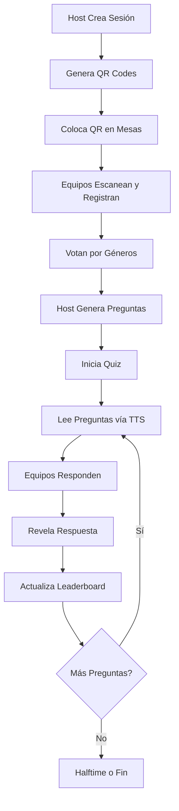

# 🎤 Perfect DJ Pub Quiz System

Sistema completo de trivia/pub quiz con IA, registro por QR, votación de géneros y leaderboard en tiempo real.


---

## ✨ Características Principales

### 🎯 Basado en Mejores Prácticas de Pub Quiz
- **40-60 preguntas** distribuidas en 5-7 rondas temáticas
- **50 géneros** disponibles para votación de equipos
- **Duración:** 1.5-3 horas configurables
- **Equipos:** 4-6 jugadores por equipo (recomendado)

### 📱 Registro con QR Code
- QR único por sesión de quiz
- Formulario mobile-friendly
- Votación de géneros favoritos (hasta 5)
- Sistema de bonificación por redes sociales (+1 punto)

### 🎲 Generación Inteligente de Preguntas
- Selección automática basada en votos de equipos
- Mix de dificultades (easy/medium/hard)
- Fun facts y hints incluidos
- Listo para integrar con OpenAI/Claude

### 🏆 Sistema de Puntuación
- Leaderboard en tiempo real
- Puntos bonus por engagement social
- Actualización automática
- Ranking dinámico

### 🎮 Vista del Host
- Dashboard profesional
- Control completo del quiz
- Preguntas grandes para TTS
- Botones de show answer / next question
- Progress bar visual

### ⚡ Sistema de Buzzers (Opcional)
- Estructura para buzzers BLE
- Compatible con ESP32, Arduino
- Ronda final estilo game show
- Ordenamiento por timestamp

---

## 🚀 Quick Start

### 1. Migrar Base de Datos

```bash
cd backend
python manage.py makemigrations api
python manage.py migrate
```

### 2. Inicializar Géneros

```bash
curl http://localhost:8000/api/pub-quiz/initialize-genres
```

### 3. Crear Sesión de Quiz

```bash
curl -X POST http://localhost:8000/api/pub-quiz/create-session \
  -H "Content-Type: application/json" \
  -d '{
    "venue_name": "The Cross Keys",
    "host_name": "Perfect DJ",
    "total_rounds": 6,
    "questions_per_round": 10
  }'
```

### 4. Abrir Vista del Host

```
http://localhost:8000/pub-quiz/host/1
```

### 5. Compartir URL de Registro

```
http://localhost:8000/pub-quiz/register/1
```

O generar QR:
```
http://localhost:8000/api/pub-quiz/1/qr-code
```

---

## 📋 Los 50 Géneros Disponibles

| #  | Género | Icono |
|----|--------|-------|
| 1  | General Knowledge | 🧠 |
| 2  | Pop Music | 🎵 |
| 3  | Movies & Film | 🎬 |
| 4  | Television & Streaming Shows | 📺 |
| 5  | 80s Nostalgia | 📼 |
| 6  | 90s Nostalgia | 💿 |
| 7  | 2000s Throwback | 📱 |
| 8  | 2010s Pop Culture | 📲 |
| 9  | Current Events & News | 📰 |
| 10 | Sports | ⚽ |
| 11 | Geography & World Capitals | 🗺️ |
| 12 | History | 📜 |
| 13 | Science & Inventions | 🔬 |
| 14 | Food & Drink | 🍔 |
| 15 | Cocktails & Alcohol | 🍸 |
| 16 | Celebrities & Gossip | ⭐ |
| 17 | Disney & Pixar | 🏰 |
| 18 | Harry Potter | ⚡ |
| 19 | Superheroes & Marvel/DC | 🦸 |
| 20 | Video Games | 🎮 |

... [Ver lista completa en la documentación]

---

## 🎯 Flujo de Trabajo Típico



---

## 🎨 Personalización

### Branding
```python
# En pub_quiz_views.py
session = PubQuizSession.objects.create(
    host_name="Tu Nombre",
    social_hashtag="#TuHashtag",
    social_handle="@TuHandle"
)
```

### Hojas de Respuesta
- Diseña en Canva
- Incluye logo, QR, redes sociales
- Imprime en Vistaprint (batches de 50-100)
- Usa papel reciclado

### Colores y Estilo
Edita CSS en `pub-quiz-host.html` y `pub-quiz-register.html`

---

## 🔌 API Endpoints

| Endpoint | Método | Descripción |
|----------|--------|-------------|
| `/api/pub-quiz/initialize-genres` | GET | Inicializar 50 géneros |
| `/api/pub-quiz/create-session` | POST | Crear nueva sesión |
| `/api/pub-quiz/<id>/register-team` | POST | Registrar equipo |
| `/api/pub-quiz/<id>/generate-questions` | POST | Generar preguntas por votos |
| `/api/pub-quiz/<id>/start` | POST | Iniciar quiz |
| `/api/pub-quiz/<id>/next` | POST | Siguiente pregunta |
| `/api/pub-quiz/<id>/current-question` | GET | Obtener pregunta actual |
| `/api/pub-quiz/<id>/leaderboard` | GET | Tabla de posiciones |
| `/api/pub-quiz/<id>/stats` | GET | Estadísticas en vivo |
| `/api/pub-quiz/<id>/qr-code` | GET | Generar QR (imagen PNG) |

---

## 🤖 Integración con IA

### OpenAI GPT
```python
import openai
from .pub_quiz_generator import PubQuizGenerator

generator = PubQuizGenerator()
prompt = generator.generate_ai_prompt_for_questions(genre, num_questions=10)

response = openai.ChatCompletion.create(
    model="gpt-4",
    messages=[{"role": "user", "content": prompt}]
)
```

### Claude (Anthropic)
```python
import anthropic

client = anthropic.Anthropic(api_key=os.getenv("ANTHROPIC_API_KEY"))
response = client.messages.create(
    model="claude-3-sonnet-20240229",
    messages=[{"role": "user", "content": prompt}]
)
```

---

## 🏗️ Arquitectura

```
backend/api/
├── pub_quiz_models.py      # Modelos de DB
├── pub_quiz_generator.py   # Generador de preguntas
├── pub_quiz_views.py        # API endpoints
└── urls.py                  # Rutas configuradas

frontend/
├── pub-quiz-host.html       # Vista del host
└── pub-quiz-register.html   # Formulario de registro

docs/
├── PUB_QUIZ_EXTRACTED_INFO.md          # Info de PDFs
└── PUB_QUIZ_IMPLEMENTATION_GUIDE.md    # Guía completa
```

---

## 📊 Modelos de Base de Datos

### PubQuizSession
- Venue, host, fecha
- Configuración (rondas, preguntas, duración)
- Estado (registration, in_progress, halftime, completed)
- Géneros seleccionados

### QuizTeam
- Nombre, mesa, jugadores
- Contacto, social handle
- Puntuación total + bonus
- Votos de géneros

### QuizQuestion
- Texto de pregunta
- Respuesta correcta + alternativas
- Dificultad (easy/medium/hard)
- Fun fact, hints
- Tipo (standard, picture, music, buzzer)

### QuizRound
- Número de ronda
- Género asignado
- Estado (started_at, completed_at)
- Flags especiales (halftime, buzzer round)

---

## 🎁 Sistema de Bonificaciones

| Acción | Puntos |
|--------|--------|
| Seguir @PerfectDJ en redes | +1 |
| Primer buzzer en pregunta | +2 |
| Tag en Instagram | +1 |
| Respuesta creativa (discreción host) | +1 |

---

## 🔧 Troubleshooting

### No aparecen géneros
```bash
# Re-inicializar
curl http://localhost:8000/api/pub-quiz/initialize-genres
```

### QR no funciona
- Verificar que el servidor sea accesible desde móviles
- Usar IP local en lugar de localhost: `http://192.168.1.X:8000`

### Preguntas no se generan
- Verificar que hay equipos registrados
- Verificar que tienen votos de géneros
- Revisar logs del servidor

---

## 📱 Compatibilidad

- ✅ Chrome/Safari móvil
- ✅ Tablets
- ✅ Desktop
- ✅ Responsive design
- ⚡ Progressive Web App ready

---

## 🚀 Próximos Pasos

- [ ] Integrar IA real (OpenAI/Claude)
- [ ] Implementar sistema de buzzers BLE
- [ ] Agregar autenticación de host
- [ ] Exportar resultados a PDF
- [ ] Dashboard de analytics post-evento
- [ ] Sistema de reservas de mesas
- [ ] Integración con Spotify para rondas musicales

---

## 📝 Licencia

MIT License - Perfect DJ

---

## 🤝 Contribuir

¿Ideas? ¿Mejoras? ¡Pull requests bienvenidos!

---

## 📞 Contacto

- 🐦 Twitter/X: @PerfectDJ
- 📧 Email: contact@perfectdj.com
- 📱 Instagram: @PerfectDJ

---

**¡Haz que tu pub quiz sea legendario! 🎤🎵**
